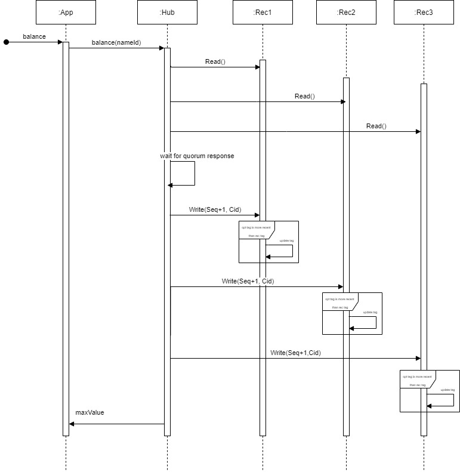

Relatório do projeto *Bicloin*

Sistemas Distribuídos 2020-2021, segundo semestre

## Autores

**Grupo T30**

| Número | Nome              | Utilizador                                     | Correio eletrónico                               |
| ------ | ----------------- | ---------------------------------------------- | ------------------------------------------------ |
| 93709  | Francisca Almeida | <https://git.rnl.tecnico.ulisboa.pt/ist193709> | <mailto:francisca.almeida@tecnico.ulisboa.pt>    |
| 93716  | Gonçalo Antunes   | <https://git.rnl.tecnico.ulisboa.pt/ist193716> | <mailto:goncalo.nuno.antunes@tecnico.ulisboa.pt> |
| 93753  | Rodrigo Pedro     | <https://git.rnl.tecnico.ulisboa.pt/ist193753> | <mailto:rodrigorpedro@tecnico.ulisboa.pt>        |

## Melhorias da primeira parte

Em relação à primeira parte foram acrescentados comentários e desenvolvidas as novas funcionalidades pedidas.

- [Implementação do Protocolo de Registo Coerente com Writeback](https://git.rnl.tecnico.ulisboa.pt/SD-20-21-2/T30-Bicloin/commit/5d4fc6e83e593a2eb734afaa73893e3e5a876789)
- [Substituição dos stubs bloqueantes por stubs assíncronos no *Hub*](https://git.rnl.tecnico.ulisboa.pt/SD-20-21-2/T30-Bicloin/commit/4c369e226ea652e366e24236f69b68b252e3a39a)
- [Substituição dos stubs bloqueantes por stubs assíncronos na *App*](https://git.rnl.tecnico.ulisboa.pt/SD-20-21-2/T30-Bicloin/commit/7147d3dd8bdf7d24e2d3e2fe1cb43cbe7c45f198)
- [Implementação da funcionalidade dos pesos nas réplicas do *Rec*](https://git.rnl.tecnico.ulisboa.pt/SD-20-21-2/T30-Bicloin/commit/1f82c1a1057e967978b1555be09fadf18ed725b5)
- [Implementação do suporte de mudança de IP e porta para as réplicas](https://git.rnl.tecnico.ulisboa.pt/SD-20-21-2/T30-Bicloin/commit/ffc0ee1e73bdb7aab4f2e1aa538a78cd17ff50a4)

## Modelo de faltas

Tal como requisitado no enunciado, é tolerada apenas uma minoria de faltas silenciosas nas réplicas. 

Quando há uma falta silenciosa, o sinal `SIGTERM` pode ser lançado (corresponde ao atalho `Ctrl+C`), se tal acontecer, cada réplica cancela o respetivo registo no serviço `ZooKeeper`, onde se pode registar novamente quando uma nova instância dessa réplica com o mesmo *path* seja inicializada.

No caso em que o sinal a ser lançado durante uma falta silenciosa é o `SIGKILL`, a réplica limita-se a terminar abruptamente, sem que haja o cancelamento do registo no serviço `ZooKeeper`.

Na situação em que o processo onde uma réplica está a ser executada é colocado em pausa, ou seja, no lançamento de um sinal `SIGTSTP` (corresponde ao atalho `Ctrl+Z`), a réplica é colocada em pausa, e qualquer chamada a tal réplica levanta uma exceção de `StatusRuntimeException` devido à conecção do *stub* com a réplica falhar, após o deadline estabelecido na chamada remota.

Como foi requisitado no enunciado, as faltas bizantinas não são toleradas, ou seja, não são terminadas réplicas do serviço *rec* de forma não arbitrária.

De modo a tolerar as faltas supramencionadas, foi implementado o Protocolo de Registo Coerente Completo. Embora a versão completa não seja necessária para este projeto em especifico, decidiu-se implementar a versão completa de modo a garantir expansibilidade do número de servidores *hub* num hipotético futuro.

## Solução

_Figura 1: Troca de mensagens para a operação balance com 3 réplicas *rec*._

O utilizador realiza uma ação na sua interface da app, como por exemplo: `bike-up estacao`. Esse pedido é cumprido através de uma chamada remota, utilizando a classe `HubFrontend`, que comunica com o servidor *Hub* através de um *stub* assíncrono. A chamada é posteriormente recebida no servidor do *Hub*, onde vai ser processada pelo serviço de *grpc* e executada na classe `HubBackend`. O `HubBackend` possui *stubs* assíncronos para realizar chamadas remotas às diferentes réplicas do *Rec* existentes no `ZooKeeper`. No caso da chamada supramencionada, vão ser trancadas as instâncias `HubUserEntry` e `HubStationEntry`, onde são guardados os dados imutáveis dos utilizadores e das estações. Após os locks serem adquiridos pela thread que está a executar a chamada pedida, vão ser feitas chamadas remotas de leituras aos quorums das réplicas *Rec*, que usam o protocolo de registo coerente, seguidas de escritas remotas dos novos valores a atualizar (saldo, número de bicicletas e número de levantamentos mais recentes). Após os valores serem atualizados nas diferentes réplicas existentes, é retornada uma resposta grpc ao *frontend* do *Hub* que fez a chamada remota inicialmente, e devolve um _OK_ ao utilizador da *App* no caso do pedido ter sido feito com sucesso. 

## Protocolo de replicação

O Protocolo de Registo Coerente é utilizado de modo a permitir a replicação correta de servidores e a tolerar faltas, de modo a que quando são realizadas leituras e escritas em registos mutáveis, os mesmos apresentem sempre os valores corretos e mais recentes. Por cada operação remota de leitura, é consultado um quorum de réplicas, que obtem o valor associado ao número de sequência maior encontrado nesse quorum, e que posteriormente é propagado para todas as réplicas ativas. No momento de escrita, o *hub* realiza uma leitura remota a todos os *Recs* de um *quorum* para obter a *tag* com maior número de sequência, e de seguida inicia o procedimento de escrita remota para todos as réplicas existentes no ZooKeeper, incrementando o número de sequência por 1 unidade e colocando o seu `cid` na *tag* que é inserida nos metadados do pedido grpc.

## Medições de desempenho

|            | Sync | Async |
| :--------- | ---- | ------|
| Tempo (ms) | 444  | 249   |

_Tabela 1 - Comparação entre stubs bloqueantes e não bloqueantes._ 

|            | Com Pesos | Sem Pesos |
| :--------- | --------- | --------- |
| Tempo (ms) | 260       | 249       |

_Tabela 2 - Stubs não bloqueantes, comparação de uso de pesos._

Foram utilizados 5 recs, 1 hub e 1 app. Os pesos utilizados foram 5, 1, 1, 1, 1.

Analisando a performance, observamos que para 5 réplicas, a implementação de pesos constantes a réplicas não oferece qualquer melhoria considerável de desempenho.
Por observação da tabela acima, podemos concluir que os valores de tempo para executar as operações no ficheiro "comandos.txt" foi relativamente mais baixo para a implementação sem pesos. No entanto, assumiu-se que para sistemas com uma dimensão maior, a implementação com pesos obterá uma performance acrescida. Tendo em conta o número de operações `read` e `write`, não parece ser relevante o uso de pesos nas mesmas, uma vez que o número de operações é equiparável (há tantos writes como reads em todas as operações com comunicação entre *hub* e réplicas *rec*).

Outro dado a notar é a melhoria de performance do uso de stubs bloqueantes para stubs não bloqueantes, onde é relevante a diferença de tempo de execução, uma vez que ao não usar stubs bloqueantes, o tempo reduz-se para metade.

## Opções de implementação

De modo a permitir futura expansibilidade do serviço, nomeadamente a implementação de réplicas do *hub*, uma possível implementação que já está presente é o uso do Protocolo de Registo Coerente Completo com writeback, de modo a assegurar que todas as réplicas de todos os servidores, quer sejam hub ou rec, tenham os valores mais recentes e corretos. Adicionalmente, acrescentou-se pesos às réplicas *rec*, que são usados para facilitar o cálculo do quorum, que dependendo do peso de cada réplica recebido numa resposta, pode ser necessário ou não menos réplicas para obter uma resposta coerente do que a maioria (número de réplicas / 2 + 1).

## Notas finais

À classe que guarda as respostas de um método remoto assíncrono, `ResponseCollector`, foi associada a classe `CountDownLatch` da biblioteca `java.util.concurrent.CountDownLatch`. Cada instância é utilizada como ajuda à sincronização de várias threads, e auxilia o utilizador com uma funcionalidade semelhante ao wait-notifyAll: a classe possui um *counter* sincronizado interno, que é declarado ao mesmo tempo em que a classe é instanciada, e que pode ser decrementado com o método `countDown()`. O método anterior é utilizado nas chamadas dos métodos da classe `StreamObserver` que foi extendida, `onError()` e `onCompleted()`, e a resposta é guardada num atributo do `ResponseCollector`, fornecido no construtor das classes `HubStreamObserver` e `RecStreamObserver`. Posteriormente à chamada remota do stub assíncrono, é utilizado o método `CountDownLatch.await()`, que impede a *thread* principal de continuar a sua execução até que o *counter* instanciado no construtor da `CountDownLatch` tenha o valor 0. 

